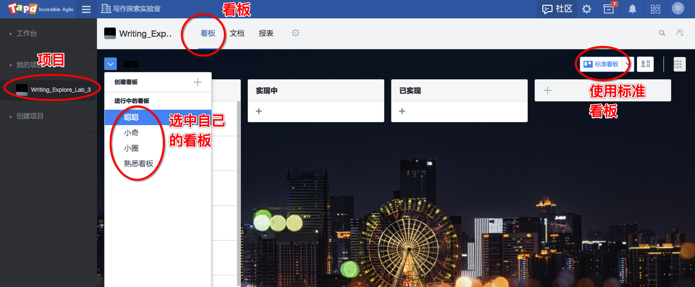
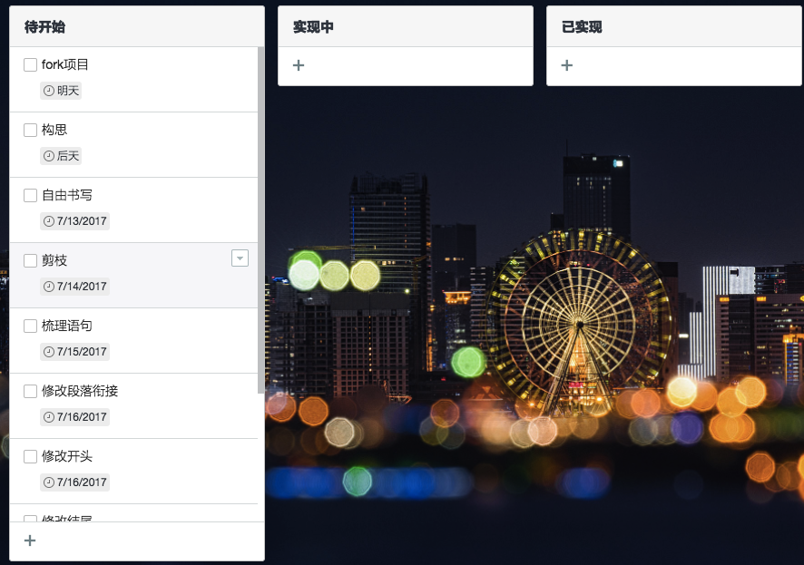

https://github.com/dumpling001/writing_explore_3 我建了一个项目，有进度、目标、经验总结、课程说明文件，这些文件后续我会维护。

目前想法是，大家fork这个项目，然后邀请我做协作者，每次修改完毕，提交pull request，我看后，给出反馈，反馈会结合微信和git协作的沟通方式。

或者大家自己单独建一个项目，邀请我为协作者。不愿公开就不要建公开项目。

另外，请大家屏蔽群消息提示。

2017-7-10 10:08
***
第三期写作探索实验室已满员，那我们就提前开始吧。请大家开始构思三个自己经历过的印象深刻的故事，建议选择2个失败1个成功的故事，建议后天开始动笔写。构思过程中有任何问题，随时微信联系我，群发也行，私信我也行。

2017-7-10 12:38
***
https://www.tapd.cn/invite_confirms/link_invite_activate?token=b051662a0e18d20dfc074ff4048324ae 我用了TAPD-腾讯敏捷产品研发平台做项目管理，给各位的进度已经单独建了看板。如果大家愿意可以接受邀请成为团队成员，自己管理自己的进度；不想弄的话我帮你们更新进度情况。操作很简单。

2017-7-10 15:26
***
