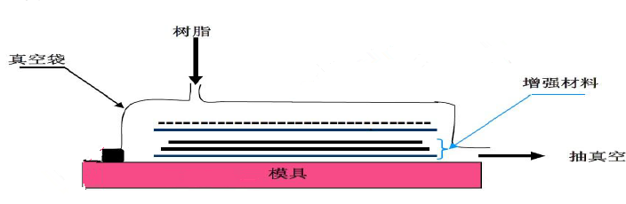

### 小成功：

刚入职的时候, 算是有一次小成功, 即我在入职的第一周, 要求从完全陌生的三个库里选出一个来, 展现我们的图像, 作为之后的开发, 三个库都很陌生, 那么就需要一个选择原则。

现状：

- a库展现效果很好, 图片是提前加载并缓存, 但是插件少, 不易做功能, 之后可能要自己手写各种插件, 已经为一个插件纠结很久了

- b库比a库展现效果差一点, 图片是按需加载并缓存, 但是插件比较丰富, 不过目前不支持我们使用的图像格式

- c 库是一个很轻量级的地图库, 插件很丰富, 但是展现效果最差, 图像加载很慢

因为我们老大的要求是图像要达到 a 库的效果, 这样其实只能选择 a 库, 但我不甘心, 又研究了b, 然后有所了解, 但是没有研究透, b的文档很难读。

不过这时发现一个类似的网站, 能使用b库展现同样的图像格式。

那个时候我存在着一个信念, 别人 5 个月能转行, 我就能, 别人两个月能学会前端, 我就能, 别人能用 b 库展现同样的资源, 尤其是前端源码还是公开的, 那我就能搞定, 于是我放弃了研究a库, 开始钻研b库, 然后仔细看 api 和相关源码, 最后发现问题是出在资源加载的路径上, 注释了两行代码之后, 图像资源成功加载。

但一开始加载效果有问题, 继续研究之后, 推测是后端参数设置的问题, 然后通过调整参数, 取得了非常好的加载效果, 选型问题被我解决。

接着是自带 api 的使用, 由于文档难读, 我又没掌握正确的使用方法, 遇到坑了一些困难, 但没想到, 由于我虽然不懂, 但是反复的看, 对各种陌生的 api 和名词也熟悉了, 也找到了一个通俗易懂的入门教程, 然后借着对例子的修修改改掌握了基本用法 。我刚刚入职两周多, 就可以完成老板想要的功能了。

项目也算由此取得突破性进展, 算是一个小成功, 老板表扬了我, 并且表示对另外两个前端的表现不满意, 结果那两个人就不开心走了。

### 失败的例子

我们公司与某比赛主办方合作提供软件, 那天有重要客人来我们公司参观, 看我们的软件, 是一位教授, 也算是我们的用户, 利用我们的软件对病例图像进行标注, 然后这些数据就给参赛选手, 进行算法训练。

我们是知道下午要展示的, 但上午为了实现某个需求, 主要是教授这边可以在图片页面上切换不同的子用户, 为此, 后端改了数据结构, 然后我也要改, 结果下午没改完, 最后给客户演示的时候是有 bug 的, 这就是关键的时候掉链子。

然后我抓紧时间修了几个bug, 赶紧说在我的电脑上演示, 没想到我的电脑突然死机。

于是乎, 关键时候再次掉了链子。简直是一次又一次的掉, 我们老板之后的说法是“从来没有想今天这么丢人过”。

这次掉链子事件, 使得我发现了我对工作的危机意识不够, 我是个坐在公交车上都能假设公交车翻了, 我应该如何反应的人。

这次我就没有做好假设, 上午临时改数据结构, 以为能改完, 最后发现这个工作量不是一天能搞定的, 没有做好准备, 预想到没搞定怎么办。

---

> 一个上午基本上就懵过去了, 不知道为什么要写, 也不知道要写什么, 直到我又打开公众微信, 看到我的关注人数竟然缓慢增加到了 30, 聪聪同学又写了那么多字, 于是在大概 4 点多的时候, 终于进入了心流的状态, 能写出东西了

再回顾前一份工作中的失败例子, 我的印象中好像有很多。因为做生产, 东西复杂, 就是属于容易出问题的。

比如做我之前做的真空灌注工艺, 简单来说先把纤维布铺好, 然后盖上真空袋密封好, 然后抽真空捡漏

如果没有漏气, 灌注树脂, 树脂会被大气压压入真空袋, 浸润纤维, 浸润完全后就封住入口和抽气口. 等待树脂固化. 固化完后脱膜, 得到产品.
这个可以做什么呢

当然, 最理想的情况是一次成功, 但是实际情况会收到各种因素的干扰.

首先, 查漏气一般需要 20 分钟以上才能确定
如果这个时候漏气了, 就不能灌注树脂, 要检漏, 但是这个环节非常难, 很难判断出哪里漏了, 实在不行就得换真空袋.

如果不漏就可以配树脂, 树脂的量要把握好, 多了就是浪费, 少了又要临时加, 万一在抽的过程中又漏气了, 临时补救会手忙脚乱.

抽好了树脂要等固化, 固化的过程中如果厚的地方过热, 过热的地方就会发白, 要赶紧浇水降温, 否则产品就是有问题的, 严重的可能要重做.

那个时候天真的我每次都预期最完美的情况, 但现实总是告诉我墨菲定律的存在, 凡是有可能出错的地方都会出错, 而我这个工艺可能出错的地方有非常的多, 而出错的后果又非常的严重.

所以我的内心经常是沮丧的. 而且这个可不是编程, 出错了会报错, 真空袋漏气了是无从找起的, 能发现漏气那也是在抽树脂的过程中, 那个时候就要救火, 赶紧把漏气的地方补上, 所以经常救火.  

这种体验真的很难受

我一直是个很自信而且理论化的人, 总觉得我和那些工人相比, 掌握了更多理论, 对做产品有更多思考, 我能比他们做的更好, 仿佛一切尽在掌握之中

尝试更科学的树脂配比, 更好的固化方案, 更少的原材料消耗, 以达到更优的产品质量. (即更少的树脂用量减少原材料消耗, 更长的固化时间使得固化后变形更少)

然而问题是, 我这样做只是理论上知道, 做的东西质量会更好, 实际上很少做产品测试, 自己的记录也不充分, 相关反馈也少, 最终我都没确定这样的做法纠结使性能提高了多少.

但更少的树脂用量, 更长的固化时间, 确实使得我在遇到真空袋漏气的时候情况变得更加紧急, 临时加的树脂总是还会浪费一些, 更久的固化时间也导致了更多的不确定性, 树脂没固化之前, 随时可能出问题.

之前还经常每次做东西之前都在内心祈祷这次不出问题, 然后偷懒而没有做好充分准备.

然后一旦出问题, 内心就非常崩溃, 为什么会出问题, 为什么会漏气, 为什么又做坏了, 我又没有做好准备.

最后经历过反复的失败打击, 多次导致产品差点报废的经历, 内心进行过多次的痛定思痛后, 使得信念坚定(思维僵固)如我也接受了这个事实, 每件产品无论大小都可能出错, 每次都要做最好的准备和最坏的打算, 也确确实实的扭转了一些我的世界观.

总之我是拥有了丰富的如何把一件产品差点搞废的经验

以前我做事, 总是按照把一件事情做好的方式来做

而现在我明白, 原来我要按照如何把一件事情做的没有不好的方式来做

这样说可能有点难以理解, 就是我们对事物的反面的理解是有偏差的

好的对立面不是不好, 而是没有好的

不好的对立面也不是好, 而是没有不好

满意的对立面不是不满意, 而是没有满意

不满意的对立面也不是满意, 而是没有不满意

这个世界根本不会按照我的理论, 我的想象来走, 永远在出各种各样的意外.

我有了丰富的把一件事情搞砸的经验和了解了世界不会按照我的理论来运行的思维

我就知道, 做事情首先应该尽可能想到所有导致失败的情况, 然后想办法做好各种准备一一避免, 以便意外发生, 能迅速处理.

总结起来就是, 面对和处理失败的能力

还记得之前我每次在颓废一段时间之后, 都会做各种学习规划, 说这周末一定要学点什么, 干点什么

然后一到周末, 什么各种活动来了, 同学也有事要去帮忙, 什么聚会, 什么生活杂事, 仿佛自己颓废的时候就有事, 一下定决心要好好学习, 就各种事情来打扰我, 仿佛别人在和自己作对, 生活总是在和自己开玩笑, 总是来干扰自己的学习.

甚至我已平静的接受了这个事实, 没有事情的时候还好, 一旦有个什么事情, 我就预感各种事情都会一起来, 然后就真的各种事情, 反正我也不知道是不是生活的玩笑

不过我在辞职的时候, 这些价值观和思维倒是给了我很大的帮助, 我知道要放弃部分安全感, 但是这只是说说, 真的做起来还是很难的, 然后我充分发挥了我的失败经验, 设想各种我转行失败的情景, 我该怎样解决. 最后, 我发现其实以我的能力, 即使失败, 养活自己倒是没有问题, 那就没啥大不了了, 辞就辞呗

我获得了面对第三层恐惧的能力.

恐惧有三个层次；
　　第一个层次是恐惧事情本身。
　　第二个恐惧是害怕失去背后的价值
　　真正的恐惧是，你觉得自己没有能力去应对这个失去。
　　比如说很多人害怕公众演讲，这是第一个层次。第二个层次你发现，自己真正害怕的不是公众演讲，而是怕讲砸；但是在最深的低处，他真正恐惧的不是讲砸，而是自己没有能力应对自己讲砸的状况。那才是你内心深处的不自信与恐惧。

《面对恐惧，从容面对》（FeeltheFearAndDoItAnyway）

2017年7月13号 8:20反馈：

1）“要求从完全陌生的三个库里选出一个来, 展现我们的图像”--能否给出图像效果实例？
为什么需要一个选择原则？谁告诉你的？还是你自己认为的？原因写出来。
"所以根据我的信念, 如果别人能搞定, 那我就能搞定, "为什么你有这样的信念？
“这时发现一个类似的网站, 能使用b库展现同样的图像格式。”建议给出gif动图展示。
“最后发现问题, ”是什么问题？

2） “那天有重要客人来我们公司参观”——有多重要？
“但上午为了实现某个需求”——这个需求与给客户的演示相关吗？需要说明
我们老板之后的说法是“从来没有想今天这么丢人过”。——事后有没有跟老板沟通过这次损失有多大？自己有没有做什么弥补？如果没有做过, 现在可以补上, 然后补充在这个故事里面。

3）“再回顾前一份工作中的失败例子, 我的印象中好像有很多。”——后面一个事例也没有看到。一个事例包含时间、地点、人物、事件起因、经过、结果。而不是仅仅是想法。
