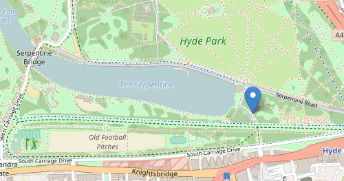

刚入职的时候, 算是有一次小成功, 即我在入职的第一周, 要求从完全陌生的三个库里选出一个来, 展现我们的图像, 作为之后的开发, 三个库都很陌生, 那么就需要一个选择原则。

现状：

- a库展现效果很好, 图片是提前加载并缓存, 但是插件少, 不易做功能, 之后可能要自己手写各种插件, 已经为一个插件纠结很久了

- b库比a库展现效果差一点, 图片是按需加载并缓存, 但是插件比较丰富, 不过目前不支持我们使用的图像格式

- c 库是一个很轻量级的地图库, 插件很丰富, 但是展现效果最差, 图像加载很慢

> b, c 动图对于非专业人员来说, 还是不容易看懂

因为我们老大的要求是图像要达到 a 库的效果, 这样其实只能选择 a 库, 但我不甘心, 又研究了b, 然后有所了解, 但是没有研究透, b的文档很难读。

不过这时发现一个类似的网站, 能使用b库展现同样的图像格式。

那个时候我存在着一个信念, 别人 5 个月能转行, 我就能, 别人两个月能学会前端, 我就能, 别人能用 b 库展现同样的资源, 尤其是前端源码还是公开的, 那我就能搞定, 于是我放弃了研究a库, 开始钻研b库, 然后仔细看 api 和相关源码, 最后发现问题是出在资源加载的路径上, 注释了两行代码之后, 图像资源成功加载。

但一开始加载效果有问题, 继续研究之后, 推测是后端参数设置的问题, 然后通过调整参数, 取得了非常好的加载效果, 选型问题被我解决。

接着是自带 api 的使用, 由于文档难读, 我又没掌握正确的使用方法, 遇到坑了一些困难, 但没想到, 由于我虽然不懂, 但是反复的看, 对各种陌生的 api 和名词也熟悉了, 也找到了一个通俗易懂的入门教程, 然后借着对例子的修修改改掌握了基本用法 。我刚刚入职两周多, 就可以完成老板想要的功能了。

项目也算由此取得突破性进展, 算是一个小成功, 老板表扬了我, 并且表示对另外两个前端的表现不满意, 结果那两个人就不开心走了。
