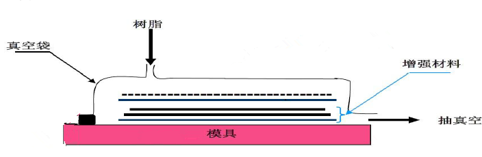
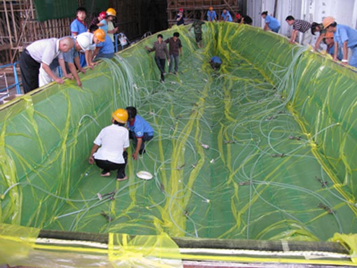

## 从失败中磨练出的能力

我已经转行程序员, 从工作内容上来说, 和上一份工作一点关系都没有了, 但是, 我在上一份工作中获得了一些很重要的东西, 这些是与工作无关的, 更加底层的能力, 而这个能力是由...大量失败反馈出来的。

我之前是一名复合材料的工艺工程师, 主要做真空灌注工艺, 简单来说先把纤维布铺好, 再盖上真空袋密封好, 然后抽真空捡漏. 因为做生产, 东西复杂, 就是容易出问题。

如果整个操作下来没有漏气问题, 那就可以灌注树脂, 树脂被大气压压入真空袋, 浸润纤维.

等待树脂固化完后脱膜, 得到产品.

比如船体就可以这样一次成型.

当然, 最理想的情况是一次成功, 但是实际情况会受到各种因素的干扰.

- 漏气一般需要 20 分钟以上才能确定

- 如果这个时候漏气了, 要检漏

- 不漏就可以配树脂, 树脂的量要把握好, 多了就是浪费, 少了又要临时加

- 抽好了树脂要等树脂固化

- 产品做好了要脱膜水切割, 万一切坏了之前所有的工作可能全部报废

所以试错的成本还是比较高的

那个时候天真的我每次做产品, 都预期最着完美的情况, 即一次成功, 不出问题.

但现实却是, 凡是有可能出错的地方都会出错(墨菲定律)

对于真空成型来说, 最麻烦的就是真空袋膜漏气, 且真空袋可能在任何一个阶段漏气

检漏阶段, 一般来说很难判断哪里漏了, 实在不行就得换真空袋, 重新检漏

抽树脂的过程中漏气了, 要赶紧找到漏气的点, 不然不停有空气进去就完蛋了

抽完了树脂要等固化, 厚的地方容易过热, 要及时浇水降温, 否则局部发白鼓包, 轻则磨掉再补, 重则返工重做

这个可不是编程, 会报错会及时反馈, 每次出问题都是情况紧急, 常常是在救火, 更重要的是, 一旦做坏, 就会感觉之前的工作全部都白费了, 浪费了时间和材料, 产品还报废了, 所以我的内心经常非常沮丧

那么, 我为什么不提前做好准备呢, 因为我自以为掌握了大量的理论知识, 按照预想的正确方法操作, 做出来就应该不出问题.

所以准备就都是多余的, 不准备...

而现实是问题一出现, 我就要救火, 并且问题常常出现, 所以我常常救火, 结果明明是我自己导致的, 还常常懊恼自己怎么没有做好准备

还有就是我总是以为, 我能够尝试更科学的树脂配比, 更好的固化方案, 更少的原材料消耗, 以达到更优的产品质量. (即更少的树脂用量减少原材料消耗, 更长的固化时间使得固化后变形更少)

然而问题是, 我只是有一定的理论基础, 但实际上做的东西很少测试, 相关反馈少, 最终我都没确定这样的做法究竟使性能提高了多少.

但更少的树脂用量, 确实使得我在遇到真空袋漏气的时候, 情况变得更加紧急,

更久的固化时间也导致了更多的不确定性, 提高了风险.

而风险发生的时候, 我的内心还总是很崩溃, 最后出问题过很多次, 也有多次导致产品差点报废的经历, 反复痛定思痛后, 我接受了这个事实.

- 每件产品无论大小都可能出错, 每次都要做最好的准备和最坏的打算, 否则就可能出错然后我就容易内心很崩溃.

不过这也确确实实的扭转了我的世界观, 我发现原来可以通过把一件事情做坏的方式去把它做好.

因为, 我在拥有了丰富的把一件产品差点搞废的经验之后, 得到了一种能力: 我终于可以在做之前就想到所有搞砸的可能, 然后通过充分准备, 将其一一避免, 就如芒格所说:

> 我只想知道将来我会死在什么地方,这样我就永远不去那儿了。

(——《穷查理宝典》第二章)

当然, 也有问题避免不了的, 那我也提前做好心理准备, 把我的心理上的损失, 也尽可能降低.

---

有一道著名的餐馆的面试题目：

如果你的餐盘掉下来，你又无力挽救，那你该怎么办？

最佳答案就是：用尽全力，把餐盘抛向离你最近的没有妇女和孩子的方向。

---

每次做坏了东西, 就这样想想, 东西已经做坏, 而我又无力挽救, 已经变成了沉没成本, 最好的处理方式不是浪费时间浪费心情, 而是马上去着手重做, 争取把下一个做好.

- 另外我还明白, 这个世界根本不会按照我的理论, 我的想象来走, 永远在出各种各样的意外, 就如墨菲定律能成为定律也正是如此.

总结起来就是, 我从事了一个容易失败的工作, 但我得到的不仅是沮丧和内心崩溃, 我也从长期的沮丧和内心崩溃中, 得到了处理和面对失败的能力

所以我切身体会到了, 小失败并不可怕, 反复的小失败也不可怕, 可能这还是人生的常态, 关键是我不让这些失败击溃我, 我就可以在这些失败中变得更强. 并且这种能力的获得是不可逆的!

那我在获得了这个能力之后, 我与以前的我有什么不一样了呢

..转行的时候..

转行是一个重大决定, 当这个想法在我大脑中出现的时候, 我心中其实是恐惧的.

放弃过去所学的专业, 大学4年加上工作一年岂不是白费了..想到这里就浑身发毛, 并且我还要面对转行后的不确定性, 我是我根本无法把握的.

那我最终..怎么还是转行了呢...

心路历程我就不展开了, 总之我是在互联网的冲击之下, 相信我一定要进入互联网, 所以转行是必须的.

那既然如此, 之前那些经历就都变成了沉没成本, 我继续工作, 就是继续追加成本, 我就是在做一件对未来没有帮助的工作, 所以尽快辞职反而变成了当务之急...

但, 即便是当务之急了, 在具体的事情面前, 也还是会有点虚...

比如: 辞职会不会给这些前同事留下很不好的印象, 领导挽留我要怎么办, 我会很长时间没有收入, 或者入不敷出, 还可能转行失败, 没找到工作. 前面的恐惧都还好, 最终的恐惧是我找不到工作, 没有饭吃了, 可能要回家啃老还是怎么搞.

但, 我既然已经获得了不可逆的能力, 那么面对这些或小或大可能导致失败的问题, 我都可以提前想好解决方案, 避免失败的可能. 并且即使失败发生, 我能从心理上接受.

那么这些方案就开始在我大脑中具体化.

从辞职开始, 假设领导硬要留我, 我就说我已经报了一个培训班, 半个月后就会开课了, 不留后路.

然后, 假设我学完了前端, 要找两个月才能找到工作, 我需要选一个价格低且靠谱的培训班, 以便留下足够的钱支持我在大城市无收入生活3个月.

假设, 我最终真的转行失败, 之前所有的钱都打了水漂...那我可以再回老本行试一试

假设, 真的没人要我...我可以回家端盘子! 不过我判断, 以我的能力, 这个事件不会发生.

最后, 我既然都假设到这个份上了, 而且我具有面对最终的失败了能力, 那我就没好怕的了, 辞职转行就可以从思想层面慢慢转化到行为层面了.

然后我做出了我的决定...获得了一种掌握命运的感觉...

所以, 我很感谢上一份工作, 它让我学会了如何失败, 然后我由如何失败推导出了如何不失败, 并且在失败无法挽回的时候, 如何面对失败.

2017-7-22 17:17 反馈：

1. 再回顾前一份工作中的失败例子, 我的印象中好像有很多。————**这现在是单独的一篇文章，这样开头会让读者觉得莫名其妙。**
2. 就是属于容易出问题的————**这句话通顺吗？的什么？如果把”属于”、“的”去掉，会影响句意吗？**
3. 比如做我上一份工作做的真空灌注工艺, ————**既然上面已经讲了是上一份工作的事，这里就无须重复说明“上一份工作做的”了。**
4. 然后盖上真空袋密封好, 然后抽真空捡漏————**建议不要连续重复用两个同样的连词。**
5. 中文写作，要用中文标点符号“，。（）”，不要用英文的标点符号“,.()”。缺少标点符号的地方都要补上。
6. “然而我还总觉得我掌握了大量的理论知识的人, 我按照我理论当中正确的方法操作, 就应该不出问题啊”————**两句话里有四个“我”，必要的地方可以用“自己”替代，不是必要的，可以删除；**
7. 那个时候天真的我每次做产品, 都预期最着完美的情况, 即一次成功, 不出问题.

但现实却是, 凡是有可能出错的地方都会出错(墨菲定律)

对于真空成型来说, 最麻烦的就是真空袋膜漏气, 且真空袋可能在任何一个阶段漏气

检漏阶段, 一般来说很难判断哪里漏了, 实在不行就得换真空袋, 重新检漏

抽树脂的过程中漏气了, 要赶紧找到漏气的点, 不然不停有空气进去就完蛋了

抽完了树脂要等固化, 厚的地方容易过热, 要及时浇水降温, 否则局部发白鼓包, 轻则磨掉再补, 重则返工重做

这个可不是编程, 会报错会及时反馈, 每次出问题都是情况紧急, 常常是在救火, 更重要的是, 一旦做坏, 就会感觉之前的工作全部都白费了, 浪费了时间和材料, 产品还报废了, 所以我的内心经常非常沮丧

然而我还总觉得我掌握了大量的理论知识的人, 我按照我理论当中正确的方法操作, 就应该不出问题啊

导致的后果是, 我以为不会出问题, 所以没有做充分的准备

而现实是问题一出现, 我就要救火, 并且问题常常出现, 所以我常常救火, 结果明明是我自己导致的, 还常常懊恼自己怎么没有做好准备

还有就是我总是以为, 我能够尝试更科学的树脂配比, 更好的固化方案, 更少的原材料消耗, 以达到更优的产品质量. (即更少的树脂用量减少原材料消耗, 更长的固化时间使得固化后变形更少)

然而问题是, 我只是有一定的理论基础, 但实际上做的东西很少测试, 相关反馈少, 最终我都没确定这样的做法究竟使性能提高了多少.

但更少的树脂用量, 确实使得我在遇到真空袋漏气的时候, 情况变得更加紧急,

更久的固化时间也导致了更多的不确定性, 提高了风险.

而风险发生的时候, 我的内心还总是很崩溃, 最后出问题过很多次, 也有多次导致产品差点报废的经历, 反复痛定思痛后, 我接受了这个事实.

——————

**这一整段，会让读者思路在你以为的情况和现实情况下跳来跳去，感到阅读困难，需要重新调整叙述顺序。建议分成两部分，一部分专门叙述你以为的情况，一部分叙述现实情况。**

8. 我从事了一个容易失败的工作,————**这个会让读者以为你的工作失败。你文章的意思，是在说你的工作所做的事情，会遇到很多次失败。所以这样会让读者产生误解。写东西时要多想想读者，比如你公众号里的读者，不是你的同学、同事，而是一个完完全全的陌生人，你要尽可能清楚明白的叙述，才让他理解、看懂你的话。**
9. 我与以前的我有什么不一样了呢

..转行的时候..
————**自己想一下前一句跟后一句搭不搭。问的是what，答的是when。**
10. 当这个想法在我大脑中出现的时候, 我心中其实是恐惧的.————**你通篇的主题是如何应对失败，从失败中学到的东西，不是恐惧。所以要把“恐惧”转化成与“失败”相关的词语。**
11. 心路历程我就不展开了, 总之我是在互联网的冲击之下, 相信我一定要进入互联网, 所以转行是必须的.

那既然如此, 之前那些经历就都变成了沉没成本, 我继续工作, 就是继续追加成本, 我就是在做一件对未来没有帮助的工作, 所以尽快辞职反而变成了当务之急...

但, 即便是当务之急了, 在具体的事情面前, 也还是会有点虚...
————**这部分与主题无关，尽量简要带过。**

怎样成为一个高手, 刻意练习
即时反馈, 这个反馈真的太即时了,
一旦开始做, 每一秒都在给反馈,
而且这个反馈还很深刻, 做的不好, 马上报废给你看, 代价惨重

所以我怎么对待产品, 产品就怎么对待我,

生活需要提醒,
我明明知道, 我不准备好, 就可能出各种问题, 造成严重后果, 可是我依然怀着侥幸心理, 所以
